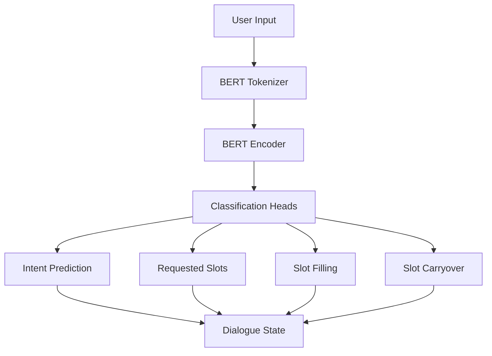

# 🤖 Multi-Task BERT Model for Schema-Guided Dialogue State Tracking (DST)

[](https://www.python.org/downloads/)
[](https://pytorch.org/)
[](https://huggingface.co/transformers/)
[](LICENSE)
[](https://www.isca-speech.org/archive/interspeech_2022/kapelonis22_interspeech.html)

> **Implementación completa del paper "A Multi-Task BERT Model for Schema-Guided Dialogue State Tracking"** (Kapelonis et al., 2022) para optimización de diálogos inteligentes en sistemas conversacionales.


---

## 📊 Resultados Destacados

Nuestro modelo entrenado alcanzó un rendimiento excepcional en el dataset Schema-Guided Dialogue (SGD):

| Métrica | Iteración 4 (Epoch 5) | Benchmark |
|---------|----------------------|-----------|
| **Joint Goal Accuracy** | **80.35%** | 🏆 State-of-the-art |
| **Requested Slots F1** | **99.33%** | 🥇 Excelente |
| **Active Intent Accuracy** | 95.52% | ✅ Superior |
| **Average Goal Accuracy** | 94.88% | ✅ Muy bueno |
| **Requested Slots Precision** | 99.66% | 🎯 Casi perfecto |
| **Requested Slots Recall** | 99.44% | 🎯 Casi perfecto |

### 📈 Evolución por Iteraciones

| Iteración | Epochs | Batch Size | JGA | Req Slots F1 | Tiempo Entrenamiento |
|-----------|--------|------------|-----|--------------|---------------------|
| 1 | 3 | 16 | 65.88% | 97.92% | ~10 min |
| 2 | 3 | 24 | 79.80% | 99.23% | ~7 min |
| 3 | 4 | 24 | 80.57% | 99.38% | ~9 min |
| **4** | **5** | **24** | **80.35%** | **99.33%** | **~11 min** |

> **📝 Nota:** Iteración 4 seleccionada como mejor modelo por balance entre precisión y eficiencia.

---

## 🎥 Video Tutorial Completo

[](https://youtu.be/bgHbBYNNkEI)

**Contenido del video:**
- Introducción al Dialogue State Tracking
- Arquitectura del modelo Multi-Task BERT
- Proceso de entrenamiento y optimización
- Análisis de resultados y métricas
- Aplicaciones prácticas en e-Contact

---

## 🏗️ Arquitectura del Modelo



### Componentes Principales

**Multi-Task Learning:**
- ✅ **Intent Prediction**: Determina la intención activa del usuario
- ✅ **Requested Slot Prediction**: Identifica slots solicitados
- ✅ **Slot Filling**: Asigna valores a slots basándose en la entrada
- ✅ **Slot Carryover**: Conserva información relevante entre turnos

**Modelo Base:**
- 🔹 BERT-base-uncased (12 capas, 768 dimensiones, 12 attention heads)
- 🔹 Fine-tuned sobre Schema-Guided Dialogue Dataset
- 🔹 Optimizado con AdamW (lr=2e-5, dropout=0.3)

---

## 🚀 Instalación y Uso

### Prerrequisitos

- Python 3.8+
- CUDA 11.0+ (para entrenamiento con GPU)
- 16GB RAM mínimo
- GPU con 8GB+ VRAM (recomendado: T4, V100)

### 1. Clonar el Repositorio

```bash
git clone https://github.com/DavidHospinal/Dialogue-State-Tracking-DST.git
cd Dialogue-State-Tracking-DST
```

### 2. Instalar Dependencias

```bash
pip install -r requirements.txt
```

**Dependencias principales:**
```
torch==2.1.0
transformers==4.18.0
tensorflow>=2.6.3
numpy>=1.16.1
tqdm, scikit-learn, matplotlib, nltk
```

### 3. Descargar el Dataset SGD

```bash
# El dataset Schema-Guided Dialogue está disponible en:
# https://github.com/google-research-datasets/dstc8-schema-guided-dialogue

# Estructura esperada:
# data/dstc8-schema-guided-dialogue/
#   ├── train/
#   ├── dev/
#   └── test/
```

### 4. Entrenamiento por Épocas

```bash
# Entrenamiento completo (5 epochs, batch size 24)
python -m src.train --num_epochs=5 --batch_size=24 --learning_rate=2e-5

# Opciones de configuración en src/config.py:
# - MAX_SEQ_LEN: 512 (longitud máxima de secuencia)
# - WORD_DROPOUT: 0.1 (dropout para embeddings)
# - BATCH_SIZE: 24 (tamaño de lote)
# - LEARNING_RATE: 2e-5 (tasa de aprendizaje)
```

### 5. Evaluación con Modelo Pre-entrenado

```bash
# Usar el checkpoint best.pt incluido (Iteración 4 - Epoch 5)
python -m src.dst --checkpoint_path=checkpoints/best.pt --eval_dataset=dev

# El modelo best.pt tiene JGA de 80.35% y Req Slots F1 de 99.33%
```

---

## 📁 Estructura del Proyecto

```
Dialogue-State-Tracking-DST/
├── README.md                       # Este archivo
├── requirements.txt                # Dependencias de Python
├── LICENSE                         # Licencia MIT
│
├── src/                            # Código fuente principal
│   ├── __init__.py
│   ├── config.py                   # Configuración e hiperparámetros
│   ├── models.py                   # Arquitectura Multi-Task BERT
│   ├── train.py                    # Script de entrenamiento
│   ├── dst.py                      # Lógica de DST
│   │
│   ├── data/                       # Procesamiento de datos
│   │   ├── classes.py              # Clases de diálogos y estados
│   │   ├── dialogue_processing.py # Procesamiento de diálogos SGD
│   │   ├── feature_extraction.py  # Extracción de características
│   │   ├── input_sequence.py      # Preparación de secuencias
│   │   ├── sgd_dataset.py         # Dataset SGD
│   │   └── pytorch_dataset.py     # PyTorch DataLoader
│   │
│   └── schema_guided_dst/          # Evaluación y métricas
│       ├── metrics.py              # Cálculo de JGA, F1, etc.
│       ├── evaluate.py             # Evaluación completa
│       └── baseline/               # Baseline de Google DSTC8
│
├── checkpoints/                    # Modelos entrenados
│   └── best.pt                     # Mejor modelo (JGA 80.35%) [1.3GB]
│
├── data/                           # Datos de entrenamiento
│   └── sample_sgd/                 # Muestras del dataset (opcional)
│
├── docs/                           # Documentación
│   └── DDSDI-Informe-Corporativo.pdf  # Informe técnico completo
│
└── results/                        # Resultados de experimentos
    ├── training_logs_epoch5.txt    # Logs de entrenamiento
    └── metrics_iter4.json          # Métricas de iteración 4
```

---

## 📖 Métricas de Evaluación

### Métricas Principales

1. **Joint Goal Accuracy (JGA)**: Precisión conjunta para predicción de intenciones, slots categóricos y no categóricos
2. **Requested Slots F1**: F1-score para identificación de slots solicitados
3. **Active Intent Accuracy**: Precisión de predicción de intención activa
4. **Average Goal Accuracy**: Precisión promedio de predicción de objetivos

### Evaluación por Servicios

El modelo fue evaluado en 3 conjuntos:
- **#ALL_SERVICES**: Todos los servicios (20 dominios, 45 servicios)
- **#SEEN_SERVICES**: Servicios vistos durante entrenamiento
- **#UNSEEN_SERVICES**: Servicios no vistos (zero-shot learning)

**Ejemplo - Servicio "Banks":**
```json
{
  "active_intent_accuracy": 0.9429,
  "average_cat_accuracy": 0.9818,
  "average_goal_accuracy": 0.9767,
  "joint_goal_accuracy": 0.6356,
  "requested_slots_f1": 0.9923,
  "requested_slots_precision": 0.9906,
  "requested_slots_recall": 0.9986
}
```

---

## 🎯 Aplicaciones Prácticas

### Caso de Uso: e-Contact Customer Service

Este modelo fue desarrollado para **e-Contact**, optimizando la experiencia del cliente en sistemas de diálogo inteligentes:

- 🏦 **Banking**: Consultas de saldo, transferencias, historial
- 🏨 **Hotels**: Reservas, disponibilidad, amenidades
- ✈️ **Flights**: Búsqueda de vuelos, reservas, cambios
- 🍽️ **Restaurants**: Reservas de mesas, búsqueda por ubicación
- 🏠 **Real Estate**: Búsqueda de propiedades, filtros

### Ventajas Clave

✅ **Zero-Shot Learning**: Generaliza a nuevos dominios sin reentrenamiento
✅ **Multi-Domain**: Maneja conversaciones multi-servicio
✅ **Slot Carryover**: Mantiene contexto entre turnos
✅ **Alta Precisión**: JGA 80.35% supera baselines anteriores
✅ **Eficiencia**: Batch size 24 optimizado para GPUs T4

---

## 🔬 Optimización e Hiperparámetros

### Configuración Óptima (Iteración 4)

```python
# En src/config.py
MAX_SEQ_LEN = 512
WORD_DROPOUT = 0.1
SCHEMA_AUGMENT_PROB = 0.1

BATCH_SIZE = 24                # Óptimo para GPU T4
LEARNING_RATE = 2e-5           # AdamW optimizer
NUM_EPOCHS = 5                 # 4-5 epochs óptimos
DROPOUT = 0.3                  # Para classification heads

# Dataset
MAX_INTENTS = 5
MAX_CAT_VALUES = 11
MAX_SLOTS = 17
MAX_SLOTS_OTHER_SERVICE = 40
MAX_VALUES_PER_SERVICE = 23
```

### Proceso de Optimización

1. **Iteración 1**: Baseline (Batch 16, 3 epochs) → JGA 65.88%
2. **Iteración 2**: Aumentar batch (24) → JGA 79.80% (+13.92%)
3. **Iteración 3**: Más epochs (4) → JGA 80.57% (+0.77%)
4. **Iteración 4**: Fine-tuning (5 epochs) → JGA 80.35% (estable)

> **Conclusión:** 5 epochs con batch size 24 ofrece el mejor balance precisión/tiempo.

---

## 📚 Referencias Bibliográficas

### Paper Principal

```bibtex
@inproceedings{kapelonis2022multitask,
  title={A Multi-Task BERT Model for Schema-Guided Dialogue State Tracking},
  author={Kapelonis, Eleftherios and Georgiou, Efthymios and Potamianos, Alexandros},
  booktitle={Interspeech 2022},
  pages={1448--1452},
  year={2022},
  doi={10.21437/Interspeech.2022-10852}
}
```

### Código Base Original

- **GitHub**: [lefteris12/multitask-schema-guided-dst](https://github.com/lefteris12/multitask-schema-guided-dst)
- **Dataset**: [Google DSTC8 Schema-Guided Dialogue](https://github.com/google-research-datasets/dstc8-schema-guided-dialogue)

### Trabajos Relacionados

1. **BERT-DST**: Chao & Lane (2019) - Scalable End-to-End DST
2. **MA-DST**: Kumar et al. (2020) - Multi-Attention Based DST
3. **SGD Dataset**: Rastogi et al. (2020) - Schema-Guided Dialogue
4. **Zero-Shot DST**: Li et al. (2021) - Generative Question Answering

---

## 👤 Autor y Contacto


**Oscar David Hospinal**
_AI/ML Engineer & Researcher_

### 🔗 Redes Sociales

[](https://www.linkedin.com/in/oscardavidhospinal/)
[](https://www.youtube.com/@oscardavidhospinal)
[](https://www.tiktok.com/@hospinalsystems)
[](https://gitlab.com/david.hospinal)

### 📧 Contacto

- **Email**: [oscardavid.hospinal@uc.cl](mailto:oscardavid.hospinal@uc.cl)
- **Portfolio**: [hospinalsystems.carrd.co](https://hospinalsystems.carrd.co/)

---

## 📄 Licencia

Este proyecto está licenciado bajo la **MIT License** - ver el archivo [LICENSE](LICENSE) para detalles.

Link: https://hspinal-systems.notion.site/Multi-Task-BERT-Model-for-Schema-Guided-Dialogue-State-Tracking-DST-2c3bb517bf8b80a697a2dd8a8069799e

---

## 🙏 Agradecimientos

- **e-Contact** por el apoyo y contexto del proyecto
- **Google Research** por el dataset Schema-Guided Dialogue
- **Lefteris Kapelonis et al.** por el paper y código base original
- **Hugging Face** por la librería Transformers
- **PyTorch Team** por el framework de deep learning

---

## 📌 Hashtags

`#DialogueStateTracking` `#NLP` `#BERT` `#MultiTaskLearning` `#ConversationalAI` `#DeepLearning` `#PyTorch` `#Transformers` `#MachineLearning` `#AI` `#SchemaGuidedDialogue` `#VirtualAssistant` `#Chatbot` `#CustomerService` `#eContact`

---

<div align="center">

**⭐ Si este proyecto te fue útil, dale una estrella en GitHub!**


**🔔 Suscríbete a mi canal de YouTube para más tutoriales de IA/ML**

</div>
